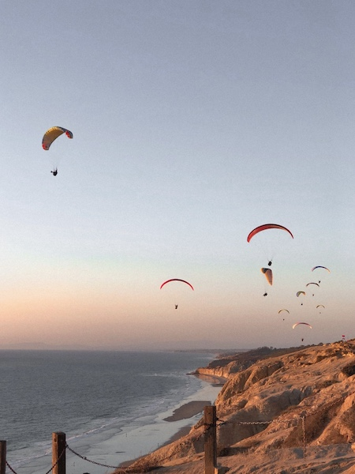

# Lauren's User Page

**Hi!** My name is Lauren & I am currently a third year Computer Science major. 

I love living in La Jolla! 
 

## My Summer Internship
This past summer, I worked at Northrop Grumman as a *Software Engineer Intern*, and I created unit tests for one of their programs called BACN. This program 
> enables a persistent Gateway in the sky that receives, bridges, and distributes communication among all participants in a battle.


In order to write tests for BACN, I had to become proficient at using git commands. Some git commands that I used a lot include:
```
git status
git add
git commit
git push
git pull
```
## My Hobbies & Extra Info About Me
Some of my hobbies include playing soccer, guitar, and taking [my dog](mars.jpg) on walks. I also enjoy baking; last month I made a [lemon poppyseed cake](SIX_E3126632-F1DC-468B-9D3A-0A5C2A933A6B.png) using [this recipe](https://thecakeblog.com/2018/02/lemon-poppyseed-cake.html), and it was delicious. Recently, I learned how to surf, so I have enjoyed spending a lot of time at the beach.

This quarter, the classes I am taking include:
- CSE 110
- CSE 101
- COGS 108

Here are the seasons, in order from my most favorite to least favorite:
1. winter
2. fall
3. summer
4. spring

This was my latest grocery store list:
- [x] broccoli
- [ ] ritz crackers
- [ ] brussel sprouts
- [x] chicken
- [x] pasta sauce

I am excited for CSE 110 & the rest of this school year!